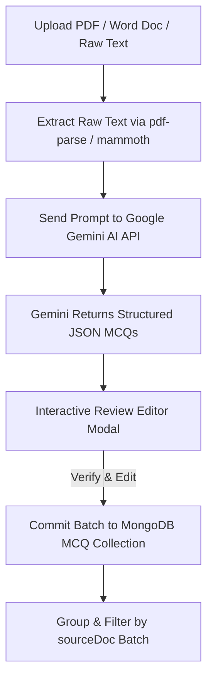

# Star Educational Academy — Comprehensive SaaS Platform Documentation

Welcome to the official documentation for **Star Educational Academy**, Ghotki's premier entry-test & board exam preparation SaaS platform founded by **Sir Irshad Ahmed Ogahi**.

---

## 📐 1. System Overview & Technology Stack

| Layer | Technologies & Libraries |
|---|---|
| **Frontend UI/UX** | React 19, Vite, Tailwind CSS v4, Framer Motion, React Router v6, React Icons, Zustand |
| **Backend API** | Node.js, Express.js, JWT (`jsonwebtoken`), `bcryptjs`, `cors`, `helmet`, `express-rate-limit` |
| **Database** | MongoDB Atlas / Local MongoDB, Mongoose ODM |
| **AI Extraction Engine** | Google Gemini API (`@google/generative-ai`) |
| **Document Processing** | `pdf-parse` (PDF text extraction), `mammoth` (Word `.docx` parsing), `multer` |
| **Branding System** | Star Emerald (`#0E4429`), Warm Cream (`#FBF8F1`), Gold (`#D4A64A`), High Contrast Accessibility |

---

## 🔐 2. Admin Super Account Credentials

The database has been purged of test data and initialized with a single Super Admin account:

- **Full Name**: Rizwan Khan
- **Email**: `khan@star.com`
- **Password**: `Rkhan007`
- **Role**: `admin`
- **Access Level**: Super Admin / System Owner

---

## 👥 3. User Roles, Workflows, Permissions & Limits

### 🌐 A. Public Unauthenticated Visitor
- **URL Routes**: `/`, `/about`, `/faculty`, `/success-stories`, `/contact`, `/lectures`, `/login`, `/register`
- **Capabilities**:
  - Browse institute mission, history, and FAQ accordion on About page.
  - View executive faculty profiles (Sir Irshad Ahmed Ogahi, Sir Jamil Arain, etc.).
  - Explore top district student rankings (MDCAT & ECAT positions).
  - Search/filter public lecture index (video playback locked).
  - Submit admission inquiry form.
- **Restrictions & Limits**:
  - Cannot access student, teacher, clerk, or admin dashboards.
  - Cannot attempt practice tests or view full PDF notes.

---

### ⏳ B. Unpaid / Pending Registered Student
- **Workflow**: Student completes `/register` form. Account is set to `isApproved: false`.
- **Login Behavior**: When attempting to log in at `/login`, the backend authentication middleware blocks entry and displays a clear notice:
  > *"Your registration is pending payment. Please pay the one-time session admission fee at the D.A.V. School office to activate your login."*
- **Capabilities**:
  - Can view cash/challan payment instructions.
- **Restrictions & Limits**:
  - Strictly blocked from accessing `/dashboard` until a Clerk or Admin verifies payment and approves the account.

---

### 🎓 C. Approved / Paid Student
- **URL Route**: `/dashboard/*`
- **Capabilities**:
  - **Video Lectures & PDF Notes**: Stream full video lectures and download subject chapter notes.
  - **Untimed Practice Mode**: Attempt quizzes with unlimited retries and instant step-by-step solution explanations.
  - **Timed Exam Mode**: Attempt official timed mock tests with active countdown timer and anti-cheat tab-blur detection.
  - **AI Performance Analytics**: View streak counter, MDCAT class rank, subject accuracy breakdown charts, and AI-recommended focus topics.
  - **Fee Voucher View**: View and download the official ₨ 5,000 session fee voucher receipt.
- **Restrictions & Limits**:
  - Cannot create, modify, or delete tests or MCQs.
  - Cannot access teacher, clerk, or admin control panels.

---

### 📑 D. Front Office Clerk
- **URL Route**: `/clerk/*`
- **Capabilities**:
  - **Student Approval Station (`/clerk/students`)**: Review pending student registration queue and grant login access (`isApproved: true`).
  - **Fee Vouchers (`/clerk/challans`)**: Issue standard one-time session fee vouchers (₨ 5,000), log payment receipt, and view downloadable PDF vouchers.
  - **Success Stories Manager (`/clerk/success-stories`)**: Full CRUD to post top student MDCAT/ECAT ranks and university admission seats to the public wall.
  - **Office Credentials (`/clerk/settings`)**: Update office password and profile settings.
- **Restrictions & Limits**:
  - ⛔ **Immutable Approved Students**: Cannot delete approved student accounts (record locked for audit compliance).
  - ⛔ **Retained Fee Vouchers**: Cannot delete issued fee challans (audit trail protected).
  - ⛔ Cannot create staff accounts or edit system-wide configurations.

---

### 👨‍🏫 E. Faculty Teacher
- **URL Route**: `/teacher/*`
- **Capabilities**:
  - **Auto Document-to-MCQ Engine**: Upload PDF or Word (`.docx`) document files or paste raw text. The engine uses `pdf-parse`/`mammoth` combined with **Google Gemini AI** to automatically extract structured MCQs.
  - **Interactive Review Editor**: Review, edit options, correct explanations, and batch-commit extracted questions into the central MCQ Bank.
  - **MCQ Bank Management**: Filter by Subject, Class (IX–XII, MDCAT), and `sourceDoc` file batches.
  - **Test Construction Wizard**: Create tests using 3 distinct modes:
    1. *Bank Selector*: Manually pick individual questions.
    2. *Random Auto-Sampler*: Specify Subject, Grade, Question Count, and Difficulty distribution (Easy / Medium / Hard).
    3. *AI Builder*: Auto-generate questions via Gemini AI or imported file batch.
  - **Lectures Manager**: Upload video URLs and attach chapter PDF notes.
- **Restrictions & Limits**:
  - Cannot issue fee challans or grant clerk/admin staff access.

---

### 👑 F. Super Admin (Executive Director)
- **URL Route**: `/admin/*`
- **Capabilities**:
  - **Staff Accounts Governance (`/admin/staff-accounts`)**: Create, issue, and manage login credentials for Teachers and Clerks.
  - **Faculty Members Directory (`/admin/faculty`)**: Manage public faculty profiles, qualifications, and display order.
  - **Hero Media & Banners (`/admin/hero-media`)**: Update landing page background slider images and announcement banners.
  - **Student Roster (`/admin/students`)**: Complete student registry overview, status toggle, and administrative password resets.
  - **Fee Voucher Oversight (`/admin/fees`)**: Revenue tracking across session admissions.
  - **Administrative Audit Log (`/admin/audit-log`)**: Security log tracking all staff approval actions, fee updates, and credential changes.
- **Restrictions & Limits**:
  - Super Root Access.

---

## 🛠️ 4. Document-to-MCQ Parsing Pipeline



---

## 💳 5. Financial & Fee Structure Governance

- **Fee Model**: **Single One-Time Session Admission Fee (₨ 5,000)** for the entire academic session.
- **No Recurring Monthly Fees**: Eliminates monthly payment tracking overhead.
- **Payment Verification**: Physical payment at D.A.V. School Office, Ghotki or direct bank deposit.
- **Access Clearance**: Student login remains locked until marked `Paid` / `isApproved: true` by Clerk or Admin.

---

## 💻 6. Quick Start & Deployment Commands

### Database Reset & Seeding:
```bash
node server/utils/seed.js
```

### Running Locally:
```bash
# Terminal 1: Backend Server (Port 5000)
cd server
npm run dev

# Terminal 2: Frontend Client (Port 5173)
cd client
npm run dev
```

### Production Build Verification:
```bash
cd client
npm run build
```
