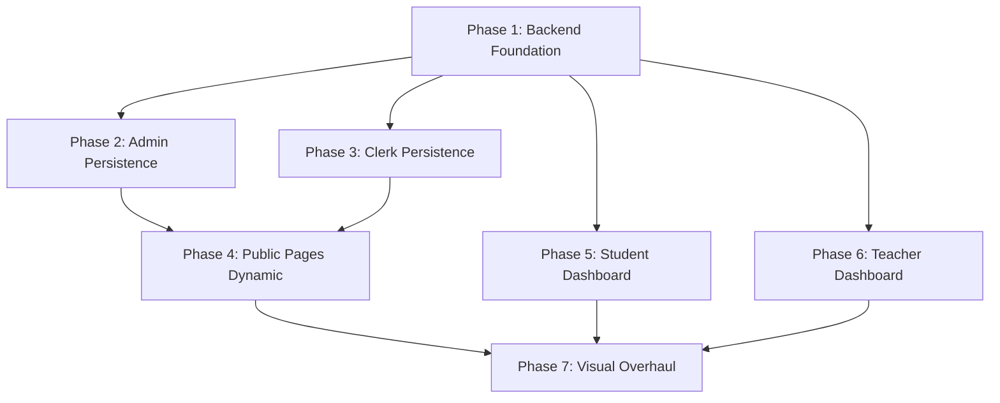

# Star Educational Academy — Full Production Plan (7 Phases)

> This plan makes **every admin/clerk/teacher action persist to MongoDB** and replaces **all hardcoded/mock data** with real API calls. Built upon the original `plan.md` architecture + patterns from the RK AI MCQs Test Platform and SEA Academy Ghotki builds.

---

## Current State Summary

### What EXISTS in the backend (5 models, 5 route files, 6 controllers):
| Model | Routes | Controller | Status |
|-------|--------|------------|--------|
| `User` | `authRoutes` + `adminRoutes` | `authController` + `adminController` | ✅ Working |
| `Lecture` | `lectureRoutes` | `lectureController` | ✅ Working |
| `Test` | `testRoutes` | `aiTestController` | ✅ Working |
| `MCQ` | `testRoutes` | `docUploadController` | ✅ Working |
| `Submission` | `attemptRoutes` | `attemptController` | ✅ Working |

### What DOESN'T exist (needs to be built):
| Model | For | Referenced in `plan.md`? |
|-------|-----|------------------------|
| `Faculty` | Admin CRUD → Public display | ✅ Yes (Section 4) |
| `SuccessStory` | Clerk CRUD → Public display | ✅ Yes (Section 4) |
| `HeroSlide` | Admin CRUD → Home hero | ✅ Yes (Section 4, called `HeroMedia`) |
| `SiteSettings` | Announcements, academy info, session dates | ✅ Implied |
| `Message` | Contact form → Admin inbox | ✅ Yes (Section 5) |
| `Milestone` | Admin/Clerk CRUD → About page | ❌ New addition per user request |
| `AuditLog` | Auto-log all admin/clerk mutations | ✅ Yes (Section 4) |

---

## Phase Overview

| Phase | Focus | New Files | Modified Files | Scope |
|-------|-------|-----------|----------------|-------|
| **1** | Backend Foundation | ~14 new server files | 1 (`server.js`) | Build all 7 missing models, routes, controllers |
| **2** | Admin Panel Persistence | 0 new | ~8 admin components | Wire admin pages to real APIs |
| **3** | Clerk Panel Persistence | 0 new | ~3 clerk components | Wire clerk pages to real APIs |
| **4** | Public Pages Dynamic | 0 new | ~6 public components | Replace hardcoded arrays with API fetches |
| **5** | Student Dashboard Dynamic | 0 new | ~5 student components | Replace fake stats with real analytics |
| **6** | Teacher Dashboard Dynamic | 0 new | ~1 teacher component | Replace fake metrics with real data |
| **7** | Visual & UX Overhaul | 2 new components | ~15+ components + CSS | Typography, cards, loading/empty states |

---

## Phase 1: Backend Foundation (Models + APIs)

> Build all 7 missing MongoDB models, their REST routes, and controllers. Also create an audit logging middleware.

### New Models to Create

#### [NEW] `server/models/Faculty.js`
```
{ name, designation, qualification, experience, subject, phone, 
  photoUrl, order, isActive, createdAt }
```

#### [NEW] `server/models/SuccessStory.js`
```
{ studentName, achievement, year, institute, score, category,
  photoUrl, order, createdBy, createdAt }
```

#### [NEW] `server/models/HeroSlide.js`
```
{ title, subtitle, badge, imageUrl, order, isActive, createdAt }
```

#### [NEW] `server/models/SiteSettings.js`
```
{ key, value }  // key-value pairs: marqueeText, bookingDate, 
                // classesStartDate, academyName, directorName, 
                // adminPhone, address
```

#### [NEW] `server/models/Message.js`
```
{ senderName, senderEmail, senderPhone, subject, message,
  status: enum[unread, read, replied], createdAt }
```

#### [NEW] `server/models/Milestone.js`
```
{ title, description, year, icon, order, isActive, createdBy, createdAt }
```

#### [NEW] `server/models/AuditLog.js`
```
{ actorId, actorName, actorRole, action, targetType, targetId,
  details, createdAt }
```

### New Route Files

#### [NEW] `server/routes/facultyRoutes.js`
- `GET /` — Public (fetch all active faculty, sorted by order)
- `POST /` — Admin only (create faculty member)
- `PATCH /:id` — Admin only (update faculty)
- `DELETE /:id` — Admin only (delete faculty)

#### [NEW] `server/routes/successStoryRoutes.js`
- `GET /` — Public
- `POST /` — Clerk/Admin
- `PATCH /:id` — Clerk/Admin
- `DELETE /:id` — Clerk/Admin

#### [NEW] `server/routes/heroSlideRoutes.js`
- `GET /` — Public
- `POST /` — Admin only
- `PATCH /:id` — Admin only
- `DELETE /:id` — Admin only

#### [NEW] `server/routes/settingsRoutes.js`
- `GET /` — Public (for session dates, marquee, academy info)
- `PATCH /` — Admin only (bulk update settings)

#### [NEW] `server/routes/messageRoutes.js`
- `POST /` — Public (contact form submission)
- `GET /` — Admin only (fetch all messages)
- `PATCH /:id/status` — Admin only (mark read/replied)
- `DELETE /:id` — Admin only

#### [NEW] `server/routes/milestoneRoutes.js`
- `GET /` — Public
- `POST /` — Admin/Clerk
- `PATCH /:id` — Admin/Clerk
- `DELETE /:id` — Admin/Clerk

#### [NEW] `server/routes/auditLogRoutes.js`
- `GET /` — Admin only (with pagination + role filter)

### New Controllers

#### [NEW] `server/controllers/facultyController.js`
CRUD for faculty members with audit logging on each mutation.

#### [NEW] `server/controllers/successStoryController.js`
CRUD for success stories with audit logging.

#### [NEW] `server/controllers/heroSlideController.js`
CRUD for hero slides with audit logging.

#### [NEW] `server/controllers/settingsController.js`
Get/update site-wide settings.

#### [NEW] `server/controllers/messageController.js`
Create (public), list/update/delete (admin).

#### [NEW] `server/controllers/milestoneController.js`
CRUD for milestones with audit logging.

### New Middleware

#### [NEW] `server/middleware/auditLogger.js`
A helper function called inside controllers after every create/update/delete to log:
```js
await AuditLog.create({
  actorId: req.user.id,
  actorName: req.user.fullName,
  actorRole: req.user.role,
  action: 'CREATE_FACULTY',
  targetType: 'Faculty',
  targetId: doc._id,
  details: `Created faculty member: ${doc.name}`
})
```

### Modify Existing

#### [MODIFY] `server/server.js`
- Mount all 7 new route files
- Add profile update and password change to auth routes

#### [MODIFY] `server/routes/authRoutes.js`
- Add `PATCH /profile` — update name/phone (authenticated user)
- Add `POST /change-password` — change password (authenticated user)

#### [MODIFY] `server/controllers/authController.js`
- Add `updateProfile` handler
- Add `changePassword` handler

#### [MODIFY] `server/controllers/adminController.js`
- Fix `getPublicStats` — remove fake `|| 184` fallback values, return real 0
- Add `getTeacherMetrics` — return student count, MCQ count, test count, lecture count
- Wire staff account creation to use `User.create()` (currently just local state)

#### [MODIFY] `server/routes/adminRoutes.js`
- Add route for `GET /teacher-metrics`
- Add route for staff account CRUD

#### [MODIFY] `server/controllers/attemptController.js`
- Enhance `getStudentAnalytics` to return:
  - Subject-wise breakdown (aggregate by test subject)
  - Total tests taken
  - Average percentage
  - Streak calculation (consecutive days with submissions)

### Client Services (for Phase 2-6)

#### [NEW] `client/src/services/facultyService.js`
#### [NEW] `client/src/services/successStoryService.js`
#### [NEW] `client/src/services/heroSlideService.js`
#### [NEW] `client/src/services/settingsService.js`
#### [NEW] `client/src/services/messageService.js`
#### [NEW] `client/src/services/milestoneService.js`
#### [NEW] `client/src/services/auditLogService.js`

---

## Phase 2: Admin Panel — Wire to Real Backend

> Every admin page becomes fully persistent. No more local `useState` CRUD that vanishes on refresh.

#### [MODIFY] `AdminFaculty.jsx`
- Fetch faculty list from `GET /api/faculty`
- Create → `POST /api/faculty`
- Edit → `PATCH /api/faculty/:id`
- Delete → `DELETE /api/faculty/:id`
- Add loading spinner, empty state, success/error toasts

#### [MODIFY] `AdminHeroMedia.jsx`
- Fetch slides from `GET /api/hero-slides`
- Create/Delete → API calls
- Add loading/empty states

#### [MODIFY] `AdminAnnouncements.jsx`
- Fetch marquee text + dates from `GET /api/settings`
- Save → `PATCH /api/settings`
- Persist broadcast data to MongoDB

#### [MODIFY] `AdminSettings.jsx`
- Fetch academy info from `GET /api/settings`
- Save → `PATCH /api/settings`
- Export CSV → fetch real students from `GET /api/admin/students` and generate CSV

#### [MODIFY] `AdminStaffAccounts.jsx`
- Fetch staff list from `GET /api/admin/staff` (users with role teacher/clerk/admin)
- Create staff → `POST /api/auth/register` (with role)
- Delete staff → `DELETE /api/admin/staff/:id`

#### [MODIFY] `AdminMessages.jsx`
- Fetch messages from `GET /api/messages`
- Mark read/replied → `PATCH /api/messages/:id/status`
- Delete → `DELETE /api/messages/:id`

#### [MODIFY] `AdminAuditLog.jsx`
- Fetch real logs from `GET /api/audit-logs`
- Remove hardcoded log entries
- Add pagination support

#### [MODIFY] `AdminHome.jsx` (minor)
- Ensure metrics are showing 0 when DB is empty (not fake numbers)

---

## Phase 3: Clerk Panel — Wire to Real Backend

> Clerk's success stories and dashboard metrics become real.

#### [MODIFY] `ClerkSuccessStories.jsx`
- Fetch from `GET /api/success-stories`
- Create → `POST /api/success-stories`
- Edit → `PATCH /api/success-stories/:id`
- Delete → `DELETE /api/success-stories/:id`
- Add loading/empty states

#### [MODIFY] `ClerkDashboard.jsx`
- Fetch real metrics from `/api/admin/metrics`
- Replace hardcoded `3, 18, 3, ₨ 90,000` with real counts

#### [NEW] Add Milestones CRUD page to Clerk (and Admin) dashboard
- New nav item in clerk sidebar
- Fetch from `GET /api/milestones`
- Create/Edit/Delete via API

---

## Phase 4: Public Pages — Replace Hardcoded Data with API Calls

> Every public page that shows hardcoded arrays gets wired to real backend data.

#### [MODIFY] `Home.jsx`
- Stats bar: default to `0`, fetch from `/api/admin/public-stats` — remove fake `184, 45, 120, 1500`
- Faculty preview: fetch from `/api/faculty` (limit 6)
- Achievements: fetch from `/api/success-stories` (limit 4)
- Session dates: fetch from `/api/settings`
- Add loading states for each section

#### [MODIFY] `Faculty.jsx` (public)
- Remove hardcoded faculty array
- Fetch from `GET /api/faculty`
- Add loading spinner + empty state

#### [MODIFY] `Lectures.jsx` (public)
- Remove `sampleLectures` array
- Fetch from `GET /api/lectures`
- Add loading spinner + empty state ("No lectures uploaded yet")

#### [MODIFY] `SuccessStories.jsx` (public)
- Remove hardcoded stories array
- Fetch from `GET /api/success-stories`
- Add loading/empty states

#### [MODIFY] `Contact.jsx`
- Wire form submission to `POST /api/messages`
- Show real success/error feedback

#### [MODIFY] `About.jsx`
- Milestones section: fetch from `GET /api/milestones`
- Session dates: fetch from `/api/settings`

---

## Phase 5: Student Dashboard — Replace All Fake Stats

> Student sees real data from their actual test submissions.

#### [MODIFY] `DashboardHome.jsx`
- Fetch real analytics from `/api/attempts/analytics`
- Replace hardcoded `12 tests`, `88%`, `7 Days`, `Paid` with real data
- Fetch available tests from `/api/tests` for test cards
- Add loading states

#### [MODIFY] `StudentLectures.jsx`
- Remove `studentLecturesList` mock array
- Fetch from `/api/lectures` with auth
- Wire video player to real media URLs
- Wire PDF download to real URLs
- Add loading/empty states

#### [MODIFY] `StudentTests.jsx`
- Remove `fallbackTests` array entirely
- Show only API data
- Add "No tests available yet" empty state

#### [MODIFY] `StudentAnalytics.jsx`
- Remove `subjectStats` mock array and all hardcoded numbers
- Fetch from enhanced `/api/attempts/analytics`
- Show "Take tests to see your analytics" if no submissions
- Compute recommendations from real weak subjects

#### [MODIFY] `StudentSettings.jsx`
- Wire profile form → `PATCH /api/auth/profile`
- Wire password change → `POST /api/auth/change-password`
- Show real success/error toasts

---

## Phase 6: Teacher Dashboard — Replace Fake Metrics

#### [MODIFY] `TeacherHome.jsx`
- Fetch real metrics from `/api/admin/teacher-metrics`
- Replace `184`, `1,420`, `18`, `42` with actual counts
- Replace hardcoded "Recent Activity" entries with real recent submissions
- Add loading states

---

## Phase 7: Visual & UX Overhaul

> Fix all typography, card layouts, responsive grids, and add global loading/empty state components.

#### [NEW] `client/src/components/ui/LoadingSpinner.jsx`
- Emerald-themed spinner with academy branding
- Skeleton card variant for grid layouts

#### [NEW] `client/src/components/ui/EmptyState.jsx`
- Configurable icon + title + description + optional CTA button
- Used across all pages when DB returns 0 records

#### [MODIFY] `client/src/index.css`
- Bump minimum body text from `12px` → `14px` for readability
- Bump label minimums from `10px/11px` → `12px`
- Enforce card padding minimum `p-6`
- Add responsive fluid type scale
- Clean up card border/shadow system
- Ensure Playfair Display + Manrope fonts load correctly

#### [MODIFY] All dashboard and public page components
- Replace `text-xs` body copy → `text-sm`
- Replace `text-[11px]`, `text-[10px]` → `text-xs` minimum
- Ensure all card grids use CSS Grid with explicit `gap-6`
- Test at 360px, 768px, 1024px
- Migrate inline hex values to design system tokens where applicable

---

## Execution Order & Dependencies



> **Phase 1 must be done first** — all other phases depend on the backend APIs existing.
> Phases 2-6 can overlap but are ordered for clean dependency flow.
> Phase 7 is the final polish after all data is live.

---

## Verification Plan

### Per-Phase Checks
- **Phase 1**: Start server, hit every new API endpoint with test requests, verify MongoDB documents are created
- **Phase 2-3**: Login as admin/clerk, perform CRUD, refresh page — data must persist
- **Phase 4**: Visit public pages with empty DB — see loading spinners then empty states (no fake data)
- **Phase 5-6**: Login as student/teacher — see real 0s and empty states (no fake numbers)
- **Phase 7**: Browser test at 360px, 768px, 1024px — no overlaps, readable text, clean cards

### Final Production Checklist
- [ ] Zero hardcoded mock arrays remaining in client
- [ ] Every admin form persists to MongoDB
- [ ] Every public page fetches from API
- [ ] Loading spinners appear during fetch
- [ ] Empty states appear when DB has 0 records
- [ ] Typography minimum 12px for labels, 14px for body
- [ ] Cards have consistent padding and borders
- [ ] Responsive grids work at all breakpoints
